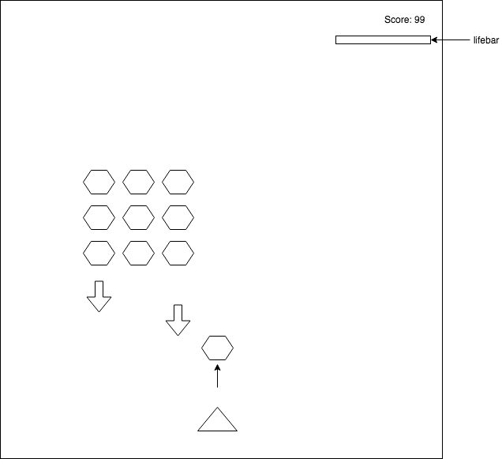

# README - UltraRapidFire

## Background and Overview
UltraRapidFire will be a fast pace classic arcade style shooter inspired by old retro sprite based games such as Space Invaders, and Cho Ren Sha. The player will control a ship using each of the arrow keys to move, and the space bar to shoot.

There will be 4 different types of enemy ships that will fire bullets in different patterns with increasing difficulty to avoid
+ directly straight forwards
+ towards the player's current location
+ a cluster of bullets that are shot in the direction of the player
+ a large spiral pattern that moves out radially

## Features/MVPs

The game will have sound effects, and music running in the background, all of which will be toggle-able.

The player will also be able to pause the game. 

The player will be able to set the game speed at the beginning of the game with a slider as a way to change the difficulty.

When certain enemies are destroyed, they will release power-up packages that will increase the number of bullets that the player's ship can shoot.

## Technologies/Architecture

The main technologies used will be vanilla Javascript, and Canvas. The specific ship images, and bullets will be sprites taken from opensource websites. 

The main game logic will be `game.js`, and there will also be a folder for objects, which will have files for `enemy.js`, and `bullet.js` that will hold the logic for how each of those objects move, and their collision properties, since the bullets will damage on impact.

## Wireframe

## Timeline

### Day 1

+ Set up game on webpack (`webpack.config.js`, `package.json`).
+ Get a basic player ship sprite moving around on the screen with controls, create basic enemy class, and be able to shoot at it
+ Render a scrolling background that will give the feel of moving at high velocity

### Day 2 
+ Create shooting enemies
+ Extend the enemy class to make an enemy that will shoot at you in a spiral fashion.
+ Add explosion effects that render when ships are destroyed

### day 3
+ Learn `Web Audio API` to enable music and game sound effects
+ implement a scoring system, one that will keep track of time survived in the game and also types of enemies destroyed
+ implement the logic for enemies at the player's direction.

### day 4
+ implement power-up system such that destroying some enemies will drop power up boxes, which will upgrade the player's gun (make the player shoot multiple bullets a time, or shoot homing rockets)
+ Create a boss enemy mothership class, that fires the bullets from every type of enemy, and has a health bar, and a set movement pattern.

### day 5
+ polish up visuals

